# 第七章：ajax

## Ajax 介绍

> 全称：Asynchronous Javascript And XML
> 
> 作用：**获取服务器的数据** 

### 应用场景

1. 页面上拉加载更多数据
2. 列表数据无刷新分页
3. 表单项离开焦点数据验证
4. 搜索框提示文字下拉列表

### 运行环境

> Ajax技术需要运行在网站环境中才能生效，当前课程会使用 Node 创建的服务器作为网站服务器。

==总结：局部、异步刷新== （异步不阻塞、页面无刷新通信）


### Ajax 运行原理及实现

**运行原理：Ajax 相当于浏览器发送请求与接收响应的代理人**，以实现在不影响用户浏览页面的情况下，**局部更新页面数据**，从而提高用户体验。


## 服务器客户端与网络 通信协议

### 服务器与客户端

服务器：能够提供某种服务的电脑

客户端：想使用服务器所提供服务的电脑

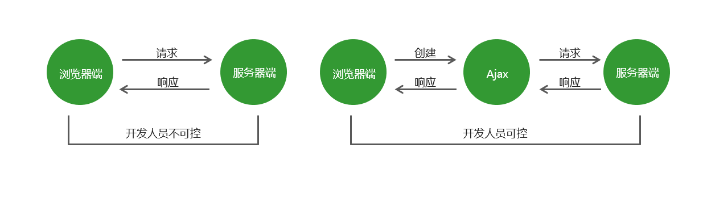

### 网络：IP 域名

**IP 地址：** 在网络中是唯一的标识，**通过IP 地址，能找到特定的服务器。** 

> 比如：百度服务器的 IP 地址为：180.101.49.12

**域名：** 相对于 IP 地址来讲，更方便记忆。

> 比如：百度域名：www.baidu.com

```cmd
查看本机IP地址：
C:\Users\Admin> ipconfig
```

查找域名对应的 IP 地址（外网地址）

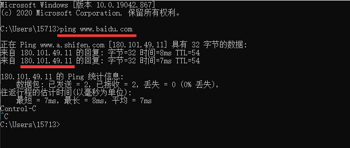


### 域名解析服务器：DNS

> 域名 通过 DNS，找到对应的 IP 地址

**DNS 提供了 域名 与 IP 地址之间的映射关系**。

访问服务器的流程：本机 hosts 文件   ==>   DNS 服务器   ==>   服务器

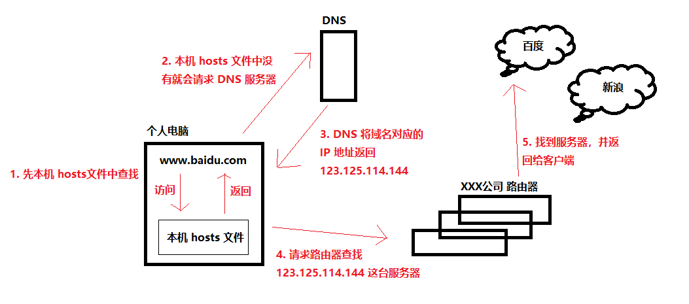

### 端口

**IP 是用来查找某一台服务器的**，但是一台服务器可能提供很多种服务，我们找到这台服务器时，**可以使用端口来访问对应的服务**。

```http
网站默认端口：80
180.101.49.12:80
数据库默认端口：3306
180.101.49.12:3306
```


### 通信协议

> 通信协议就是计算机交流时，事先规定好的规则。

**常见的协议：** 

1. HTTP、HTTPS 超文本传输协议

   - HTTP 协议 常用：请求头、请求体、响应头、响应体

2. FTP 文本传输协议

3. SMTP 简单邮件传输协议

   ==每个协议都是约定的一些规范，没必要深究。==

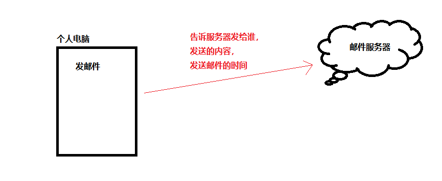

^@邮件协议示例^ 


## Wamp 的安装和配置

> Wamp 是 windows、apache、mysql、php 几个服务器软件的缩写。
>
> 作用：相当于一台本地服务器，可以在局域网内通过 IP 地址进行访问

### 服务安装

通过 [官网地址](https://sourceforge.net/projects/wampserver/) 进行下载


### 配置文件

打开安装目录，把要展示的网页放到` wamp\www` 文件夹下，通过 127.0.0.1 或者 localhost 进行访问本机服务器。

局域网内其他设备想要访问 本机服务器，则需要通过访问本机的 IP地址，才可以进行访问网页。

> 例如：192.168.1.102/index.html

#### 调整局域网权限

在安装目录下找到 `wamp\bin\apache\Apache2.4.4\conf\httpd.conf` 配置文件


^以上两种方法都可以打开该文件^

==*注意：修改配置文件之前一定要做文件备份，以免改毁文件无法撤回。*==

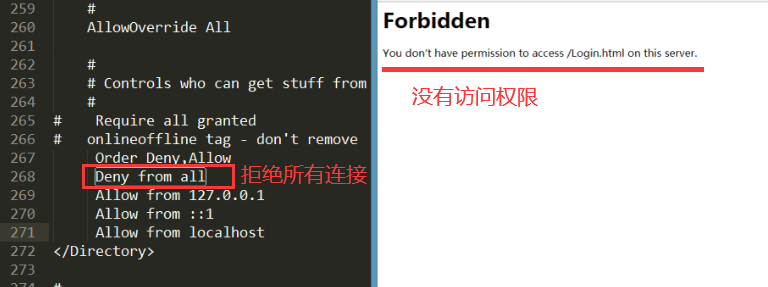

> 1. 配置文件显示 **Deny from all**，所以局域网内其他设备无法访问，所以要改为 **Allow from all**，保存文件。
>
> 2. **点击小图标，重启服务器，==一定要重启服务==。** 
>
>    
>
> 到此，局域网内就可以对本地服务器进行访问。


#### 更改网站根路径

如何不使用文件路径进行访问，可以进入  `wamp\bin\apache\Apache2.4.4\conf\httpd.conf` 配置文件 进行修改，将 DocumentRoot 的路径改为想要的路径即可。（两个路径都需要更改）

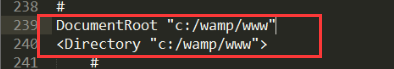

修改完配置文件后，保存并重启服务。

==更改后的路径就是网站要存放的地方。==


### 虚拟主机配置

> 根据域名请求流程，访问域名时先访问本地 hosts 文件，再去访问 DNS 解析。

1. 打开 C盘，找 `Windows\System32\Drives\etc\hosts` 文件（打开时用 Notepad++ 管理员运行文件）
2. 在文件最后加上 本机IP地址  和  自定义的域名

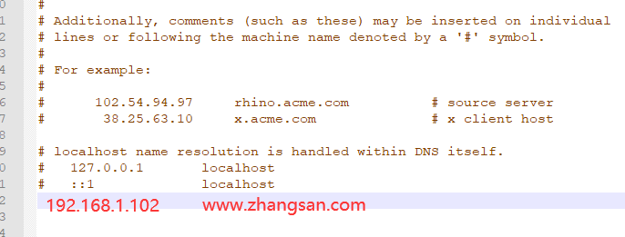

此时，就可以通过自定义域名进行访问了。


#### 一台服务器提供多个站点

> 打开安装目录，进入  `wamp\bin\apache\Apache2.4.4\conf\httpd.conf` 配置文件 进行修改，搜索关键字 **Virtual hosts** 


1. 去掉 # ，并打开这个配置文件（ `wamp\bin\apache\Apache2.4.4\conf\extra\httpd-vohsts.conf` ）

2. 想要几个站点，就复制几份配置文件

   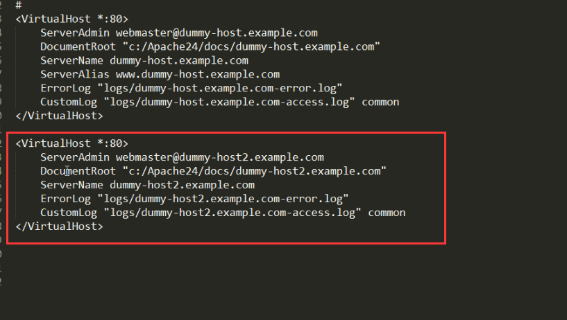

   ==复制出来的配置文件，只需要使用两个，多余的可以删掉。==

   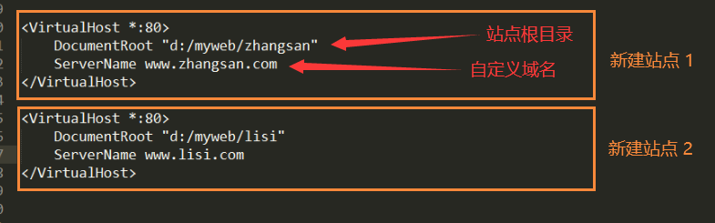

3. 通过 自定义域名+网页名 就可以进行访问

   ```http
   www.zhangsan.com/test.html
   ```


测试过程中想要在自己的电脑上访问（域名），则需要在 hosts 文件中进行配置。

> 在最后加上自定义域名

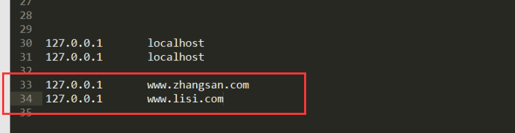

**网址会进行域名重定向** 

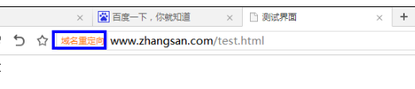


## GET 和 POST 请求

### GET 请求

> 获取；如果**向服务器发送请求，获取服务器的资源**，使用GET方式。
>
> - 获取页面中需要的数据（获取一个用户的信息）

### POST 请求

> 邮寄（提交）。如果**提交数据给服务器**，那么使用POST方式。
>
> POST 方法用于将实体提交到指定的资源，通常导致在服务器上的状态变化或副作用。
>
> **添加、修改都可以使用 POST 请求，因为此类操作都会改变服务器上的资源。** 
>
> - 登录、注册（提交账号和密码给服务器）


### 其他请求

#### PUT 请求

> PUT方法用请求有效载荷替换目标资源的所有当前表示。
>
> 修改操作可以选择使用 PUT 方式。

#### DELETE 请求

> DELETE方法删除指定的资源。
>
> 删除操作可以使用 DELETE 方式。


## jQuery 中封装的 Ajax 相关方法

> 引入脚本网络地址：[https://www.bootcdn.cn/](https://www.bootcdn.cn/)

### $.get() 方法

> $.get() 函数的功能单一，**专门用来发起 get 请求**，从而将服务器上的资源请求到客户端来进行使用。
>
> 参数一：请求资源地址。 

```javascript
/ 语法格式：
$.get(url, [data], [success], [datatype]);
```

| 参数     | 类型                  | 含义                                                     |
| :------- | :-------------------- | :------------------------------------------------------- |
| url      | string                | **必需。**请求的资源的地址，一般由后端同学提供 。        |
| data     | string\|array\|object | 不必需。 请求参数，由后端同学设计。                      |
| success  | function              | 不必需。请求成功后触发的回调函数，函数的形参为响应结果。 |
| dataType | string                | 不必需。预期服务器响应数据的类型，一般不用设置。         |

#### 获取数据

```javascript
// 发送 get请求，获取数据
let btn = document.querySelector('button');

btn.addEventListener('click', (e = window.event) => {
    $.get('http://www.liulongbin.top:3006/api/getbooks', data => {
        // 打印响应结果
        console.log(data);
    })
})
```

#### 获取某一条数据

```javascript
链接后加查询条件
例如：'http://www.liulongbin.top:3006/api/getbooks?id=1'
```


#### 删除某一条数据

>```javascript
>链接后加删除条件
>例如：'http://www.liulongbin.top:3006/api/delbooks?id=1'
>```

```javascript
btns[2].addEventListener('click', (e = window.event) => {
    $.get("http://www.liulongbin.top:3006/api/delbook?id=2", data => {
        console.log('当前删除数据：', data);
    })
})
```

#### 删除当前所有数据

> 思路：
>
> 1. 获取当前所有元素的，存储到新数组中。
> 2. 循环当前数组，并删除当前元素下标为当前数组元素 id 值。

```javascript
btns[3].addEventListener('click', (e = window.event) => {
    $.get("http://www.liulongbin.top:3006/api/getbooks", data => {
        let list = data.data;

        for(let i=0; i<list.length; i++) {
            $.get(`http://www.liulongbin.top:3006/api/delbook?id=${list[i].id}`, data => {
                console.log('当前删除数据：', data);
                console.log('删除成功');
            })
        }

    })
})
```


### $.post 方法

> 用来添加数据。
> 
> 参数一：请求资源地址。 **参数二：请求参数。参数三：回调函数。** 

```javascript
// 语法格式：
$.post(url, [data], [success], [datatype]);
```

```javascript
// 发送 get请求，获取数据
let btns = document.querySelector('button');

btn[0].addEventListener('click', (e = window.event) => {
    $.get('http://www.liulongbin.top:3006/api/getbooks', data => {
        // 打印响应结果
        console.log(data);
    })
})

// 发送 post 请求，添加数据
btns[1].addEventListener('click', (e=window.event) => {
    // 定义要添加的数据
    let data = { bookname: "一个人就一个人", author: "刘同", publisher: "图书出版社" };
    $.post("http://www.liulongbin.top:3006/api/addbook", data, data => {
        console.log(data);
    })
})
```


### $.ajax 方法

> 相当与 get 方法和 post 方法的封装。

>**type：不写默认是 get** 
>
>==**执行不一样的操作时，要改链接后的 api 接口地址。**== 
>
>- ```javascript
>  url: 'http://www.liulongbin.top:3006/api/delbook?id=2',
>  url: 'http://www.liulongbin.top:3006/api/getbooks',
>  ```

```javascript
btns.addEventListener('click', (e = window.event) => {
    $.ajax({
        type: 'post',
        url: 'http://www.liulongbin.top:3006/api/addbook',
        data: { bookname: "一个人就一个人", author: "刘同", publisher: "图书出版社" },
        success: function (res) {
            console.log(res);
        }
    })
})

// res 表示返回的数据
```


## 接口及接口文档

### 接口

> 后端设计的接口。
>
> 接口是服务器提供的一个url地址，通过这个url地址，我们可以操作服务器上的资源。
>
> 通过Ajax技术向一个接口发送请求，也叫做调用接口。


### 接口文档

> 后端提供的接口使用手册。

|   包含内容   |                   解释                   |
| :----------: | :--------------------------------------: |
|   接口说明   | 通过接口说明，大致了解到接口是干什么用的 |
|  接口的url   |         发送ajax请求，必要的条件         |
| 接口请求方式 |         发送ajax请求，必要的条件         |
|   请求参数   | 参数名称、数据类型、是否必填、参数说明等 |
|   响应格式   |                                          |
|   响应示例   |                                          |


## Network 控制台

待补充


## XMLHttpRequest 对象

> XHR 1.0 是一个内建的浏览器对象，可以实现 Ajax 请求，Ajax技术的核心就是XMLHttpRequest 对象。
>
> ==GET是在open里传参，POST是在send里传参。== 

### 原生 Js 实现基本的 GET 请求

#### 获取所有数据

```javascript
// 1.创建XMLHttpRequest 对象
var xhr = new XMLHttpRequest();

// 2.监听 onreadystatechange 事件
xhr.onreadystatechange = function () {
    // 2.1 当 Ajax 请求响应完后，再拿到服务器响应的数据
    if (xhr.readyState == 4) {
        // 2.2 用 JSON.parse 将结果转成对象
        console.log( JSON.parse(xhr.responseText) );
    }
}

// 3.设置请求方式和请求地址
xhr.open('get', 'http://www.liulongbin.top:3006/api/getbooks');

// 4.发送 ajax 请求
xhr.send();
```


#### 获取指定数据

```javascript
// 创建 xhr 对象
var xhr = new XMLHttpRequest();
// 注册事件
xhr.onreadystatechange = function () {
    // 当 Ajax 请求响应完后，再拿到服务器响应的数据
    if (xhr.readyState == 4) {
        // 用 JSON.parse 将结果转成对象
        console.log( JSON.parse(xhr.responseText) );
    }
}
// 设置请求头，并设置要获取的数据id
xhr.open('get', 'http://www.liulongbin.top:3006/api/getbooks?id=1');
// 提交请求体
xhr.send();
```


#### 删除数据

> 删除 id 为 5686 的数据。

```javascript
btns[2].addEventListener('click', (e = window.event) => {
    // 创建 xhr 对象
    var xhr = new XMLHttpRequest();

    // 注册事件
    xhr.onreadystatechange = function () {
        var res = xhr.responseText;
        if (xhr.readyState == 4) {
            // 用 JSON.parse 将结果转成对象
            console.log( JSON.parse(xhr.responseText) );
        }
    }

    xhr.open('get', 'http://www.liulongbin.top:3006/api/delbook?id=5686');

    // 提交请求体
    xhr.send();

});
```


### 原生 Js 实现基本的 POST 请求

> **和 GET请求有以下区别：** 
>
> - 在open 和 send 之间，**必须设置请求头**，通过 Content-Type 标识提交的数据类型（编码格式）。
>
>   ```javascript
>   xhr.setRequestHeader('Content-Type', 'application/x-www-form-urlencoded');
>   ```
>
> - **提交的请求体**，不是拼接到url后面，而是当做send方法的参数。
>
>   ```javascript
>   xhr.send('bookname=史记&author=司马迁&publisher=北京大学出版社');
>   ```

#### 添加数据

```javascript
// 创建 xhr 对象
var xhr = new XMLHttpRequest();

// 注册事件
xhr.onreadystatechange = function () {
    if (xhr.readyState == 4) {
        // 用 JSON.parse 将结果转成对象
        console.log( JSON.parse(xhr.responseText) );
    }
}

xhr.open('post', 'http://www.liulongbin.top:3006/api/addbook');

// 设置请求头
xhr.setRequestHeader('Content-Type', 'application/x-www-form-urlencoded');

// 提交请求体
xhr.send("bookname=书名&author=作者&publisher=出版社");
```


## 原生 Js 进行封装

> 还原 jQuery 中的 get 和 post 方法的封装。
>
> > 分析：
> >
> > - 函数只有一个参数，是一个对象。
> >   - 包括：type、url、data、success 四个属性。
> > - GET 和 POST 请求，都需要创建 xhr 对象，都需要设置 onreadystatechange 事件。
> > - 当得到响应结果后，调用 success 函数后，把结果传递给 success 函数。
> > - 需要把对象形式的请求参数，转换成查询字符串。
> > - 由于GET和POST的 “open”和 “send”不一样，所以判断，然后分开写。
> > - 优化（默认GET、大小写等等）。

```javascript
// 调用
ajax({
    url: 'http://www.liulongbin.top:3006/api/getbooks',
    type: 'get',
    data: { id: 1 },
    success: function (res) {
        console.log(res);
    }
})

// 封装原生 Js 方法
function ajax(option) {

    // 1.将对象参数 转成 相应格式的字符串
    var params = objectToString(option.data);
    var type = option.type;

    var xhr = new XMLHttpRequest();

    xhr.onload = function () {
        if (xhr.status == 200) {
            console.log(JSON.parse(xhr.responseText));
        }
    }

    // 判断类型，返回
    if (type == 'get') {
        xhr.open(type, `${option.url}?${params}`);
        xhr.send();
    } else {
        xhr.open(type, option.url);
        xhr.send(params);
    }

}

// 请求参数
function objectToString(data) {
    var list = [];
    for (var key in data) {
        list.push(`${key}=${data[key]}`);
    }
	
    return list.join('&');
}
```


### readyState 属性

> Ajax  从创建 xhr 对象开始，一直到完全接收服务器返回的结果为止；我们可以把整个请求响应过程划分为5个阶段。并且可以使用 xhr.readyState 属性检测当前请求执行到哪个阶段了。

readyState 属性值为一个数字，不同的数字表示Ajax的不同状态。

|          属性值          |                             状态                             |
| :----------------------: | :----------------------------------------------------------: |
|   xhr.readyState === 0   |              初始状态，表示 xhr 对象一定创建了               |
|   xhr.readyState === 1   |                     表示 open 一定调用了                     |
|   xhr.readyState === 2   |          表示 send 一定调用了，并且已经接收到响应头          |
|   xhr.readyState === 3   | 表示正在接收服务器返回的数据（可能已接收完毕，也可能正在接收中，取决于数据量的大小） |
| **xhr.readyState === 4** |                **表示 Ajax 请求响应过程完成**                |

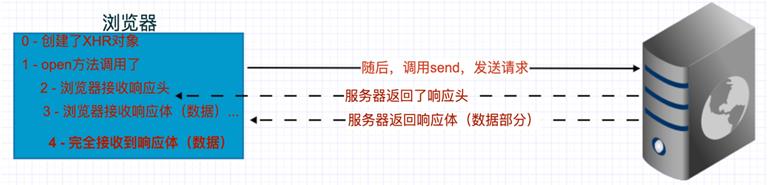


## status 属性

>status 属性表示 http 状态码，是一个数字，代码指示特定 HTTP 请求是否已成功完成。

相应分类：

- 信息响应(100–199)
- 成功响应(200–299)
- 重定向(300–399)
- 客户端错误(400–499)
- 服务器错误 (500–599)

常用状态码：

- 200 OK - 请求成功
- 400 Bad Request - 1、语义有误，当前请求无法被服务器理解。2、请求参数有误。
- 401 Unauthorized - 当前请求需要用户验证。
- 404 Not Found - 请求失败，请求所希望得到的资源未被在服务器上发现。
- 500 Internal Server Error - 服务器遇到了不知道如何处理的情况。


## URL 编码解码

> 把中文和部分特殊符号转成 URL 的标准格式，这就是 url 编码。
>
> 作用：解决乱码问题。

### 编码

> encodeURIComponent()

```javascript
var name = '张三';

var r = encodeURIComponent(name);

console.log(r);		// "%E5%BC%A0%E4%B8%89"
```

### 解码

> decodeURIComponent()

```javascript
var r = "%E5%BC%A0%E4%B8%89";

console.log( decodeURIComponent(r) );	// 张三
```


## XMLHttpRequest level 2

> XHR 2.0 对XMLHttpRequest进行了扩展。

### timeout 请求超时限制设置

> timeout 和 ontimeout

```javascript
// 1.设置请求超时时间，单位是毫秒
xhr.timeout = 30;

// 2.设置超时返回的内容
xhr.ontimeout = function () {
    console.log('请求超时了');
}
```


```javascript
// 1.创建 xhr 对象
let xhr = new XMLHttpRequest();
// 2.设置请求方式
xhr.open('get', 'http://www.liulongbin.top:3006/api/getbooks');
// 3.发送请求
xhr.send();

// 4.设置请求超时时间，单位是毫秒
xhr.timeout = 1000;
// 5.设置超时返回的内容
xhr.ontimeout = function () {
    console.log('请求超时了');
}

// 6.监听
xhr.onreadystatechange = function () {
    if (xhr.readyState == 4 && xhr.status == 200) {
        console.log(xhr.responseText)
    }
}
```


### onload 事件

> onload 事件，其你去成功时触发，**可以代替 onreadystatechange 事件。** 
>
> **使用 onload 代替 onreadystatechange，里面不用加判断，因为 onload 本身就是在请求成功时触发的。** 

```javascript
xhr.onload = function() {
    // 成功响应后，获取响应结果
    console.log(JSON.parse(this.responseText));
}
```

```javascript
// 1.创建 xhr 对象
let xhr = new XMLHttpRequest();
// 2.设置请求方式
xhr.open('get', 'http://www.liulongbin.top:3006/api/getbooks');
// 3.发送请求
xhr.send();

// 4.设置请求超时时间，单位是毫秒
xhr.timeout = 1000;
// 5.设置超时返回的内容
xhr.ontimeout = function () {
    console.log('请求超时了');
}

// 6.监听
xhr.onload = function() {
    // 成功响应后，获取响应结果
    if (xhr.status == 200) {
        console.log(JSON.parse(this.responseText));
    }
}
```


### onerror 事件

> 在请求失败时触发。**断网情况下触发。** 

```javascript
xhr.onerror = function () {
    console.log('请求失败，请检查当前网络环境');
}
```

```javascript
// 1.创建 xhr 对象
let xhr = new XMLHttpRequest();
// 2.设置请求方式
xhr.open('get', 'http://www.liulongbin.top:3006/api/getbooks');
// 3.发送请求
xhr.send();

// 4.监听
xhr.onload = function() {
    // 成功响应后，获取响应结果
    if (xhr.status == 200) {
        console.log(JSON.parse(xhr.responseText));
    }
}

// 5.请求失败
xhr.onerror = function () {
    console.log('请求失败，请检查当前网络环境');
}
```


### onprogress 事件

> 在请求完成之前周期性调用的函数。**readyState 为 3 时触发。** 
>
> **作用：可以使用 onprogress 事件，获取数据的接收（下载）进度。** 

```javascript
xhr.onprogress = function (event) {
    // 已传输的数据量
    event.loaded;
    // 总共的数据量
    event.total;
}
```

```javascript
// 1.创建 xhr 对象
let xhr = new XMLHttpRequest();
// 2.设置请求方式
xhr.open('get', 'http://www.liulongbin.top:3006/api/getbooks');
// 3.发送请求
xhr.send();

// 4.监听
xhr.onload = function() {
    // 成功响应后，获取响应结果
    if (xhr.status == 200) {
        console.log(JSON.parse(xhr.responseText));
    }
}

// 5.请求失败
xhr.onerror = function () {
    console.log('请求失败，请检查当前网络环境');
}

// 6.进度
xhr.onprogress = function (event) {
    // 已传输的数据量
    event.loaded;
    // 总共的数据量
    event.total;
}
```


### onloadstart 事件

> 下载数据之前触发。
>
> **放在 open 和 send 之间。** 

```javascript
xhr.onloadstart = function () {
    console.log('下载数据之前');
}
```

### onloadend 事件

> 下载数据完成之后需触发。
>
> **放在 open 和 send 之间。** 

```javascript
xhr.onloadend = function () {
    console.log('下载数据完成之后');
}
```

```javascript
let xhr = new XMLHttpRequest();

xhr.open('get', 'http://www.liulongbin.top:3006/api/getbooks');

xhr.onloadstart = function () {
    console.log('下载数据之前');
}

xhr.onload = function () {
    if (xhr.status == 200) {
        console.log(JSON.parse(xhr.responseText));
    }
}

xhr.onloadend = function () {
    console.log('下载数据完成之后触发')
}

xhr.send();
```


## FormData 对象

>h5出现之后，新增的一个对象。**用于管理表单数据。** 
>
>创建 FormData 对象，可直接通过 xhr.send (FormData对象) 提交给服务器的接口。

```javascript
// 获取元素
let form = document.querySelector('form');

// 实例化 formData 对象，传入form
let formData = new FormData(form);

xhr.open('post', '要提交的地址');

xhr.send(formData);
```

**==创建表单时，一定要设置 name 属性，传数据时要使用 name 属性当做 键名 来使用。==** 

> name 值是什么，键名就是什么。
>
> 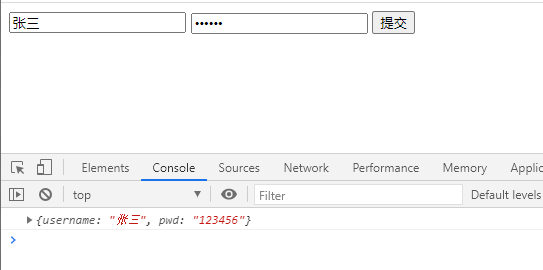

```html
<html>
    <body>
        <form>
            <input type="text" name="username" id="username" >
            <input type="password" name="pwd" id="pwd" >
            <input type="button" id="btn" >
        </form>
    </body>
    
    <script>
        // 获取元素
        let form = document.querySelector('form');
        let btn = document.querySelector('#btn');
        
    	btn.addEventListener('click', function (event) {
            let xhr = new XMLHttpRequest();
            
            // 实例化 formData 对象，传入form
            let formData = new FormData(form);
            
            xhr.open('post', 'http://121.5.153.184:3000/formData');

            xhr.onload = function () {
                if (xhr.status == 200) {
                    console.log(JSON.parse(xhr.responseText));
                }
            }
            
            // 提交数据
            xhr.send(formData);
        });
    </script>
</html>
```


### API 方法

#### append 方法

>**向对象中追加数据。** 
>
>>会追加一个自定义的属性。
>
>>```javascript
>>formData.append('key', 'value');
>>```
>
>>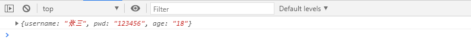

```javascript
// 获取元素
let form = document.querySelector('form');
let btn = document.querySelector('#btn');

btn.addEventListener('click', function (event) {
    let xhr = new XMLHttpRequest();

    // 实例化 formData 对象，传入form
    let formData = new FormData(form);
    
    formData.append('age', 18);

    xhr.open('post', 'http://121.5.153.184:3000/formData');

    xhr.onload = function () {
        if (xhr.status == 200) {
            console.log(JSON.parse(xhr.responseText));
        }
    }

    // 提交数据
    xhr.send(formData);
});
```


#### set 方法

> **修改对象中的数据。** 
>
> **==有同名属性，则修改该属性的值；没有同名属性，则新增该属性。==** 
>
> ```javascript
> formData.set('key', 'value');
> ```
>
> 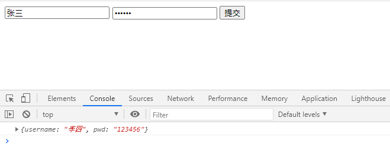

```javascript
// 获取元素
let form = document.querySelector('form');
let btn = document.querySelector('#btn');

btn.addEventListener('click', function (event) {

    // 实例化 formData 对象，传入form
    let formData = new FormData(form);
    
    formData.set('username', '李四');

    let xhr = new XMLHttpRequest();
    xhr.open('post', 'http://121.5.153.184:3000/formData');
    xhr.onload = function () {
        if (xhr.status == 200) {
            console.log(JSON.parse(xhr.responseText));
        }
    }
    // 提交数据
    xhr.send(formData);
});
```


#### delete 方法

> 从对象中删除数据。
>
> 删除指定的属性。
>
> ```javascript
> formData.delect('key');
> ```
>
> 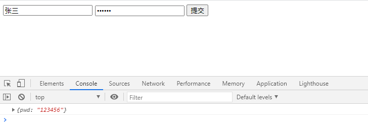

```javascript
// 获取元素
let form = document.querySelector('form');
let btn = document.querySelector('#btn');

btn.addEventListener('click', function (event) {

    // 实例化 formData 对象，传入form
    let formData = new FormData(form);
    
    formData.delete('username');

    let xhr = new XMLHttpRequest();
    xhr.open('post', 'http://121.5.153.184:3000/formData');
    xhr.onload = function () {
        if (xhr.status == 200) {
            console.log(JSON.parse(xhr.responseText));
        }
    }
    // 提交数据
    xhr.send(formData);
});
```


#### get 方法

> 获取指定 key 的一项数据。
>
> ```javascript
> formData.get('key');
> ```
>
> 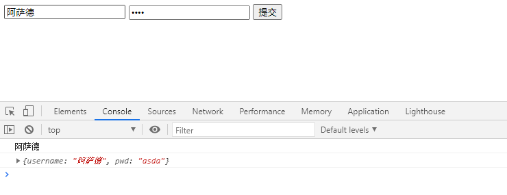

```javascript
// 获取元素
let form = document.querySelector('form');
let btn = document.querySelector('#btn');

btn.addEventListener('click', function (event) {

    // 实例化 formData 对象，传入form
    let formData = new FormData(form);
    
    console.log( formData.get('username') );

    let xhr = new XMLHttpRequest();
    xhr.open('post', 'http://121.5.153.184:3000/formData');
    xhr.onload = function () {
        if (xhr.status == 200) {
            console.log(JSON.parse(xhr.responseText));
        }
    }
    // 提交数据
    xhr.send(formData);
});
```


#### getAll 方法

> 获取指定 key 的全部数据，返回值是数组。
> 
> ```javascript
> formData.getAll('key');
> ```
> 
> 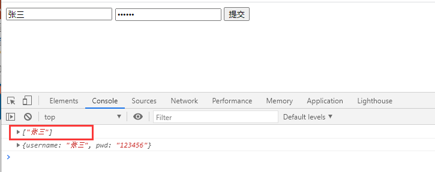


#### forEach 方法

> 遍历对象中的数据。
> 
> ```javascript
> formData.forEach(item => {
> console.log(item);
> })
> ```
> 
> 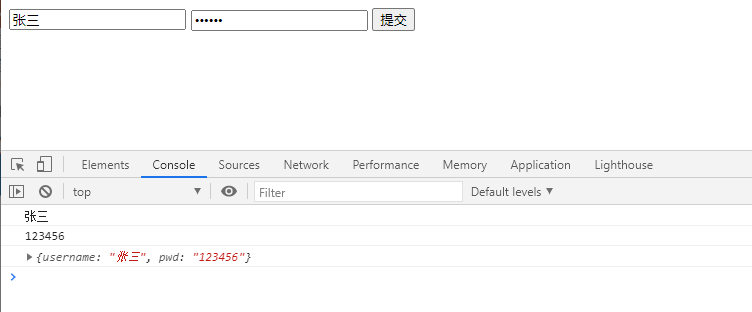

```javascript
// 获取元素
let form = document.querySelector('form');
let btn = document.querySelector('#btn');

btn.addEventListener('click', function (event) {

    // 实例化 formData 对象，传入form
    let formData = new FormData(form);
    
    formData.forEach(item => {
        console.log(item);
    })

    let xhr = new XMLHttpRequest();
    xhr.open('post', 'http://121.5.153.184:3000/formData');
    xhr.onload = function () {
        if (xhr.status == 200) {
            console.log(JSON.parse(xhr.responseText));
        }
    }
    // 提交数据
    xhr.send(formData);
});
```


## 文件上传进度监听

待补充

## CORS 跨域资源共享

待补充


## JSON

> 本质是字符串，结构和对象差不多。
>
> 键名必须要加双引号，不能写 函数 、null 和 undefined。

```json
{
    "name": "张三",
    "age": 18,
    "arr": [10, 20, 30, 40],
    "bl": true,
}
```


### JSON字符串和JS数据转换

> JS ----> JSON（序列化）：JSON.stringify( JS数据 );
> 
> JSON ----> JS （反序列化）：JSON.parse( JSON字符串 );

```javascript
var data = {
    "name": "张三",
    "age": 18,
    "arr": [10, 20, 30, 40],
    "bl": true,
}

// js 数据序列化为字符串
var jsonStr = JSON.stringify(data);
// 结果："{"name":"张三","age":18,"arr":[10,20,30,40],"bl":true}"

// 反序列化成对象
JSON.parse(jsonStr);
```


## 基于 HTTP 库 的接口（Mock.js、Fetch、axios）

### Mock.js 接口

> 官网地址：www.mockjs.com
>
> Mock.js 是一款模拟数据生成器，旨在帮助前端攻城师独立于后端进行开发，帮助编写单元测试。
>
> **简单理解：第三方库，解决数据模拟问题。** 

#### 引入库

> www.bootcdn.cn 搜索 mock.js
>
> ```html
> <!-- 引入外部链接 -->
> <script src="https://cdn.bootcdn.net/ajax/libs/Mock.js/1.0.1-beta3/mock.js"></script>
> ```

参数1：接口名

参数2：返回的数据


#### 常用的数据模拟

> ==更多模板方法，查看官网示例==：[http://mockjs.com/examples.html](http://mockjs.com/examples.html)

##### id

list|1-100：返回的list，取1~100的随机数量。

'id|+1'：每次自增1

```javascript
var data = Mock.mock('getbooks', {
    'list|1-100': [
        {
            'id|+1': 1,
            'boolName': '西游记',
        }
    ]
})

$.ajax({
    url: 'getbooks',
    success: function (res) {
        console.log(JSON.parse(data));
    }
})
```


##### 时间

```javascript
var data = Mock.mock('getbooks', {
    'list|1-100': [
        {
            'id|+1': 1,
            'data': @date("yyyy-MM-dd"),
        }
    ]
})

$.ajax({
    url: 'getbooks',
    success: function (res) {
        console.log(JSON.parse(data));
    }
})

// 结果
[
    {
    'id': 1,
	'data': @date("2000-4-28"),
    },
    {
        'id': 2,
        'data': @date("1988-3-15"),
    },
    ···
]
```


### Fetch 接口

> 官网地址：[https://developer.mozilla.org/zh-CN/docs/Web/API/Fetch_API/Using_Fetch](https://developer.mozilla.org/zh-CN/docs/Web/API/Fetch_API/Using_Fetch)
>
> Fetch 提供了一个 JavaScript 接口，用于访问和操作 HTTP 管道的一些具体部分。
>
> ```html
> <!-- 引入外部链接 -->
> <script src="https://cdn.bootcdn.net/ajax/libs/fetch/3.6.2/fetch.min.js"></script>
> ```

第一个 then(fn)：返回一个 json，通过第二个 then 接收

第二个 then(fn)：返回的是接收的数据

```javascript
fetch('http://www.liulongbin.top:3006/api/getbooks').then(function (res) {
    return res.json();
}).then(function (data) {
    console.log(data);
});
```

#### 添加数据

```javascript
fetch('http://www.liulongbin.top:3006/api/addbook', {
    method: 'POST',
    body: JSON.stringify({ auther: "吴承恩", bookname: "西游记", publisher: "北京出版社" });
    headers: new Headers({
        'Content-Type': 'application/json'
    })
}).then(function (res) {
    return res.json();
}).then(function (data) {
    console.log(data);
});
```


### axios 接口（推荐）

> 官网地址：[http://www.axios-js.com/](http://www.axios-js.com/)
>
> ```html
> <!-- 引入外部链接 -->
> <script src="https://cdn.bootcdn.net/ajax/libs/axios/0.21.1/axios.min.js"></script>
> ```

#### catch 捕获请求错误

**最后 点出 catch 可以捕获当前请求错误信息** 

```javascript
axios.get('http://www.liulongbin.top:3006/api/getbooks').then(function (res) {
    console.log(res);
}).catch(function (error) {
    console.log(error);
})
```

####  post 请求

```javascript
axios.post('http://www.liulongbin.top:3006/api/addbook', {
    bookname: '西游记',
    author: '吴承恩',
    publisher: '北京出版社',
}).then(function (res) {
    console.log(res);
}).catch(function (error) {
    console.log(error);
})
```


#### Ajax 方式

```javascript
axios({
    url: 'http://www.liulongbin.top:3006/api/getbooks',
    method: 'get',
}).then(function (res) {
    console.log(res);
})
```

```javascript
axios({
    url: 'http://www.liulongbin.top:3006/api/addbook',
    method: 'post',
    data: {
    	bookname: '西游记',
        author: '吴承恩',
        publisher: '北京出版社',
    }
}).then(function (res) {
    console.log(res);
})
```


## art-template 模板

> 官网地址：[http://aui.github.io/art-template/docs/syntax.html](http://aui.github.io/art-template/docs/syntax.html)
> 
> 艺术模板 - 高性能 JavaScript 模板引擎。
> 
> ```html
> <script src="https://cdn.bootcdn.net/ajax/libs/art-template/4.13.2/lib/template-web.js"></script>
> ```

**使用art模板时，需要使用id值进行绑定。** 

参数1：id值。参数2：对象数据。

```javascript
template('id值', {数据});
```

```html
<div class="box"> </div>

<script type="text/html" id="box">
	<h1>
    	{{uName}} - {{age}}
    </h1>
</script>

<script>
    // 设置当前 id 为 box 的数据
	var html = template('box', {uName: '张三', age: 17});
    // 打印在内容区
    document.querySelector('.box').innerHTML = html;
</script>

<!--结果：张三 - 17 -->
```


### art-template 循环语法

> each 遍历对象数组

```html
<div class="box"></div>

<!-- 遍历 data 对象中的 list，index是下标，value是每一项的值 -->
<script type="text/html" id="list">
	{{each list}}
		<h2>{{$index}} - {{$value}}</h2>
	{{/each}}
</script>

<script>
    // 准备的数据
    var data = {
        list: ['张三', '李四'],
    }
    // 遍历 data 对象
    var html = template('list', data);
    document.querySelector('.box').innerHTML = html;
</script>

<!--结果：
	0 - 张三
	1 - 李四
-->
```


### 注意事项

```txt
1. 固定语法: type，设置id值
<script type="text/html" id="list"></script>

2. 语法
template('id值', 数据);

3. 遍历语法
  是数组的话，index是数组中的下标，value是数组中的每一项
  是对象的话，index对象的每一项，value可以点出属性
{{each}}
	{{$iindex}} {{$value}}
{{/each}}
```


### art 渲染列表

> 渲染列表（接口有问题）

```html
<tbody></tbody>

<script type="text/html" id="item">
	{{each}}
		<tr>
			<td>欢迎大家</td>
			<td>
				<button>评论人：{{$value.username}}</button>
  				<button>评论时间：{{$.value.time}}</button>
    		</td>
    	</tr>
	{{/each}}
</script>

<script>
    $.ajax({
        type: 'post',
        url: 'http://www/liulongbin.top:3006/api/addcmt',
        data: {
            username: 'uName',
            content: 'content',
        },
        succrss: function (res) {
            renderList();
        }
    });

    function renderList () {
        $.ajax({
            type: 'get',
            url: 'http://www/liulongbin.top:3006/api/cmtlist',
            success: function (res) {
                if (res.status == 200) {
                    var html = template('item', res.data);
                    document.querySelector('tbody').innerHTML = html;
                }
            }
        })
    }
</script>
```


## 案例：二进制文件上传

> 需求：上传文件进度条。
>
> bootstrap官网：https://v3.bootcss.com
>
> ```html
> <link href="https://cdn.bootcdn.net/ajax/libs/twitter-bootstrap/5.0.0-beta3/css/bootstrap.min.css" rel="stylesheet">
> ```

```html
<input type="file" id="file">
<div class="progress">
    <div class="progress-bar" role="progressbar" aria-valuenow="60" aria-valuemin="0" aria-valuemax="100"
         style="width: 60%;">
        60%
    </div>
</div>
<div class="box"></div>

<script>
    // 1. 获取页面元素
    var file = document.getElementById('file');
    var bar = document.querySelector('.progress-bar');
    var box = document.querySelector('.box');
    // 2.添加change事件
    file.addEventListener('change', function () {
        // 原生js发送ajax请求
        var formData = new FormData();
        formData.append('attrName', this.files[0]);

        var xhr = new XMLHttpRequest();
        xhr.upload.onprogress = function (ev) {
            // 进度条 = 已上传 / 总量 * 100%
            var r = (ev.loaded / ev.total) * 100 + '%';
            // 进度条百分比
            bar.style.width = r;
            bar.innerHTML = r;
        }

        xhr.open('post', 'localhost:3000/upload');
        xhr.send(formData);

        xhr.onload = function () {
            
            if (xhr.status == 200) {
                var path = JSON.parse(xhr.responseText).path;
                var img = document.createElement('img');
                img.src = path;
                img.onload = function () {
                    box.appendChild(img);
                }
            }
            
        }
    })
</script>
```

